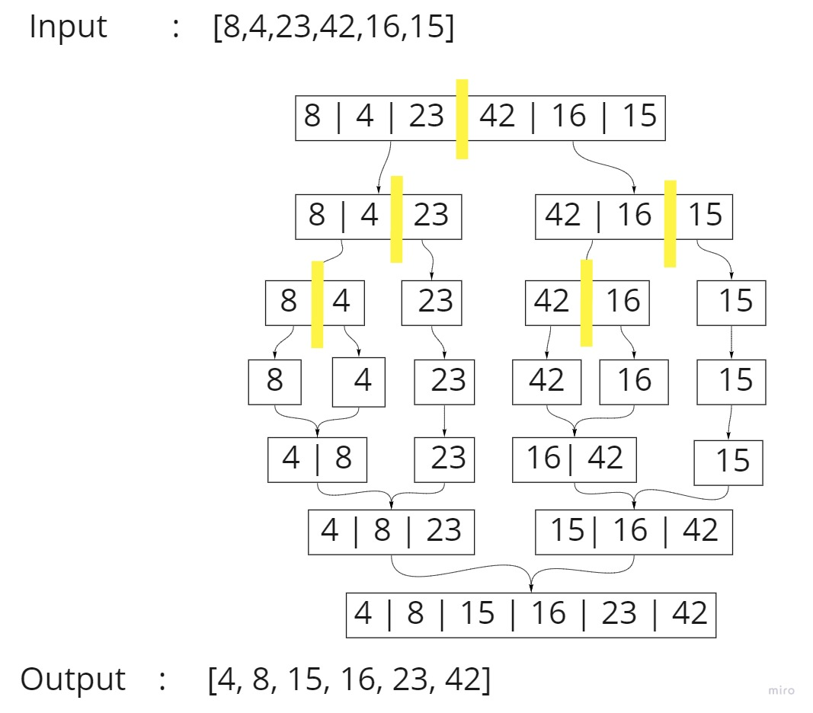

# Merge Sort

### Review the pseudocode below, then trace the algorithm by stepping through the process with the provided sample array. Document your explanation by creating a blog article that shows the step-by-step output after each iteration through some sort of visual.

## Pseudocode

```py
ALGORITHM Mergesort(arr)
    DECLARE n <-- arr.length

    if n > 1
      DECLARE mid <-- n/2
      DECLARE left <-- arr[0...mid]
      DECLARE right <-- arr[mid...n]
      // sort the left side
      Mergesort(left)
      // sort the right side
      Mergesort(right)
      // merge the sorted left and right sides together
      Merge(left, right, arr)

ALGORITHM Merge(left, right, arr)
    DECLARE i <-- 0
    DECLARE j <-- 0
    DECLARE k <-- 0

    while i < left.length && j < right.length
        if left[i] <= right[j]
            arr[k] <-- left[i]
            i <-- i + 1
        else
            arr[k] <-- right[j]
            j <-- j + 1

        k <-- k + 1

    if i = left.length
       set remaining entries in arr to remaining values in right
    else
       set remaining entries in arr to remaining values in left
```

# Trace



### Input: [8, 4, 23, 42, 16, 15]

* The array [8, 4, 23, 42, 16, 15] will be divided into two halves.
    * The first [8, 4, 23]
        - [8, 4, 23] will be split in half again.
            - The first [8, 4]
                - [8, 4] will be split in half again.
                    - first [8]
                    - second [4]
            - second [23]

    * The second [42, 16, 15]
        - [42, 16, 15] will be split in half again.
            - The first [42, 16]
                - [42, 16] will be split in half again.
                    - first [42]
                    - second [16]
            - second [15]

* After the division, the assembly will take place, but in each assembly step, the elements will be arranged in ascending order.
    - [8], [4] ->  [4, 8]
    - [4, 8], [23] ->  [4, 8, 23]
    - [42], [16] ->  [16, 42]
    - [16, 42], [15] ->  [15, 16, 42]
    - [4, 8, 23],  [15, 16, 42] -> [4, 8, 15, 16, 23, 42]

### Output: [4, 8, 15, 16, 23, 42]

# Efficency

* Time: `O(nlogn)`
* Space: `O(n)`
