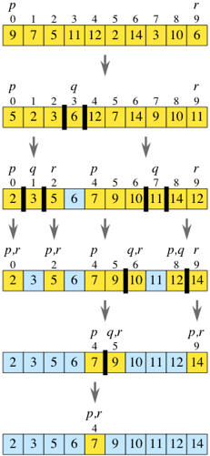

# Merge Sort

### Review the pseudocode below, then trace the algorithm by stepping through the process with the provided sample array. Document your explanation by creating a blog article that shows the step-by-step output after each iteration through some sort of visual.

## Pseudocode

```py
ALGORITHM QuickSort(arr, left, right)
    if left < right
        // Partition the array by setting the position of the pivot value
        DEFINE position <-- Partition(arr, left, right)
        // Sort the left
        QuickSort(arr, left, position - 1)
        // Sort the right
        QuickSort(arr, position + 1, right)

ALGORITHM Partition(arr, left, right)
    // set a pivot value as a point of reference
    DEFINE pivot <-- arr[right]
    // create a variable to track the largest index of numbers lower than the defined pivot
    DEFINE low <-- left - 1
    for i <- left to right do
        if arr[i] <= pivot
            low++
            Swap(arr, i, low)

     // place the value of the pivot location in the middle.
     // all numbers smaller than the pivot are on the left, larger on the right.
     Swap(arr, right, low + 1)
    // return the pivot index point
     return low + 1

ALGORITHM Swap(arr, i, low)
    DEFINE temp;
    temp <-- arr[i]
    arr[i] <-- arr[low]
    arr[low] <-- temp
```

# Trace



> Input : [9, 7, 5, 11, 12, 2, 14, 3, 10, 6]

## Pass 1:

### we'll always choose the rightmost element in the subarray, array[r], as the pivot. So, for example, if the subarray consists of [9, 7, 5, 11, 12, 2, 14, 3, 10, 6], then we choose 6 as the pivot. After partitioning, the subarray might look like [5, 2, 3, 6, 12, 7, 14, 9, 10, 11]. Let q be the index of where the pivot ends up.

## Pass 2:

### After the first partition, we have subarrays of [5, 2, 3] and [12, 7, 14, 9, 10, 11], with 6 as the pivot.

## Pass 3:

### To sort the subarray [5, 2, 3], we choose 3 as the pivot. After partitioning, we have [2, 3, 5]. The subarray [2], to the left of the pivot, is a base case when we recurse, as is the subarray [5], to the right of the pivot.

## Pass 4:

### To sort the subarray [12, 7, 14, 9, 10, 11], we choose 11 as the pivot. After partitioning, we have [7, 9, 10] to the left of the pivot and [14, 12] to the right. Then the subarrays are sorted, resulting in [7, 9, 10], followed by 11, followed by [12, 14].

> Output :  [2, 3, 5, 6, 7, 9, 10, 11, 12, 14]

# Efficency

* Time: `O(nlogn)`
* Space: `O(n)`
