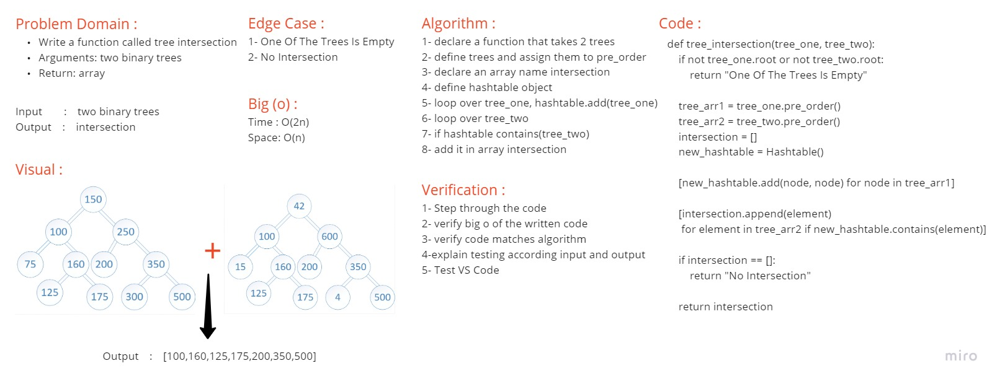
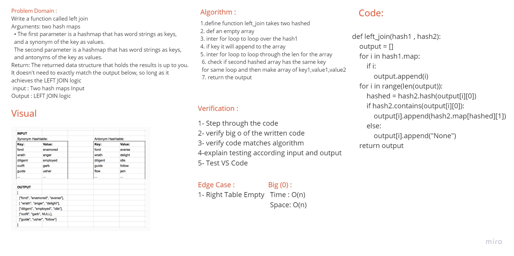

# Hashtables
<!-- Short summary or background information -->
### Hashing is a technique that is used to uniquely identify a specific object from a group of similar objects.

## PR Description Section :

| Table Of Content                               | Links                                       |
| ---------------------------------------------- | ------------------------------------------- |
| PR '1' > Implement Hashtable                   | [PR '1' > Hashtable](https://github.com/RihanFoudeh/data-structures-and-algorithms/pull/29)|
| PR '2' > hashmap-repeated-word                   | [PR '2' > hashmap-repeated-word](https://github.com/RihanFoudeh/data-structures-and-algorithms/pull/30)|
| PR '3' > Hashmap Tree Intersection                   | [PR '3' > Hashmap Tree Intersection](https://github.com/RihanFoudeh/data-structures-and-algorithms/pull/31)|
| PR '4' > Hashmap LEFT JOIN                   | [PR '4' > Hashmap LEFT JOIN](https://github.com/RihanFoudeh/data-structures-and-algorithms/pull/32)|

# Challenge
<!-- Description of the challenge -->
### Implement a Hashtable Class.

## Approach & Efficiency
<!-- What approach did you take? Why? What is the Big O space/time for this approach? -->
* add:
    - time `O(1)`
    - space `O(1)`
* get:
    - time `O(1)`
    - space `O(1)`
* contains:
    - time `O(1)`
    - space `O(1)`
* hash:
    - time `O(n)`
    - space `O(1)`

## API
<!-- Description of each method publicly available in each of your hashtable -->
* add
    - Arguments: key, value
    - Returns: nothing
    - This method should hash the key, and add the key and value pair to the table, handling collisions as needed.
* get
    - Arguments: key
    - Returns: Value associated with that key in the table
* contains
    - Arguments: key
    - Returns: Boolean, indicating if the key exists in the table already.
* hash
    - Arguments: key
    - Returns: Index in the collection for that key

# Challenge Summary - Code Challenge: Class 31
<!-- Description of the challenge -->
### Write a function called repeated word that finds the first word to occur more than once in a string

## Whiteboard Process
<!-- Embedded whiteboard image -->

## Approach & Efficiency
<!-- What approach did you take? Why? What is the Big O space/time for this approach? -->
* time `O(n)`
* space `O(1)`

# Challenge Summary - Code Challenge: Class 32 - Hashmap Tree Intersection
<!-- Description of the challenge -->
## Feature Tasks

### Find all values found to be in 2 binary trees

* Write a function called tree intersection
* Arguments: two binary trees
* Return: array

## Whiteboard Process
<!-- Embedded whiteboard image -->

## Approach & Efficiency
<!-- What approach did you take? Why? What is the Big O space/time for this approach? -->
* time `O(2n)`
* space `O(n)`

# Challenge Summary - Code Challenge: Class 33 - Hashmap LEFT JOIN
<!-- Short summary or background information -->
### Implement a simplified LEFT JOIN for 2 Hashmaps

## Challenge
<!-- Description of the challenge -->
### Write a function that LEFT JOINs two hashmaps into a single data structure

* Write a function called left join
* Arguments: two hash maps
  * The first parameter is a hashmap that has word strings as keys, and a synonym of the key as values.
  * The second parameter is a hashmap that has word strings as keys, and antonyms of the key as values.

* Return: The returned data structure that holds the results is up to you. It doesn’t need to exactly match the output below, so long as it achieves the LEFT JOIN logic

## Approach & Efficiency
<!-- What approach did you take? Why? What is the Big O space/time for this approach? -->
* time `O(n^2)`
* space `O(n)`

## Whiteboard Process
<!-- Embedded whiteboard image -->

